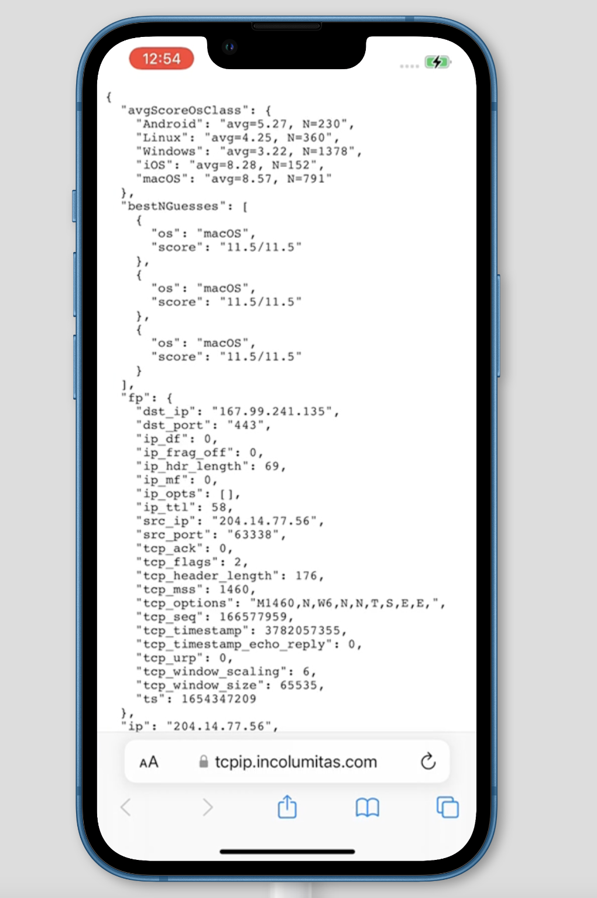
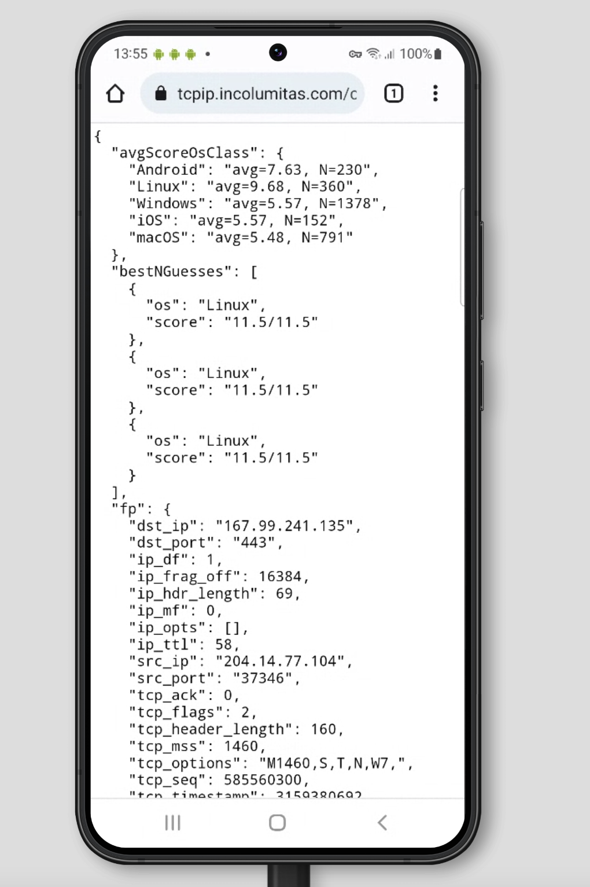
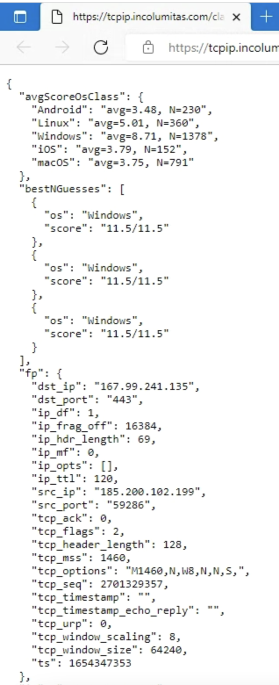
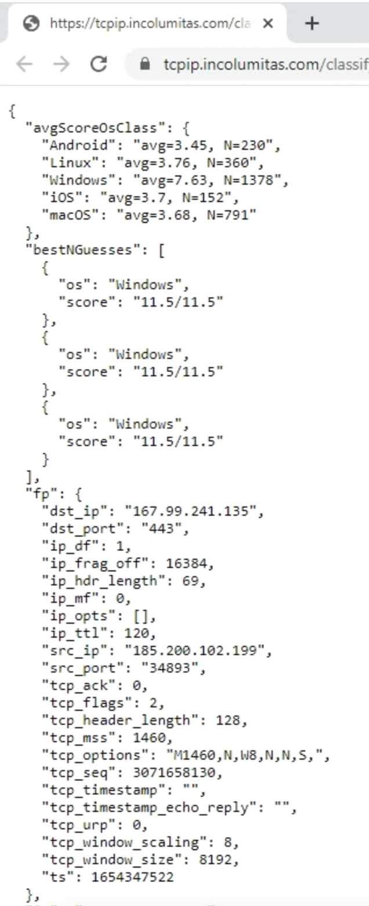
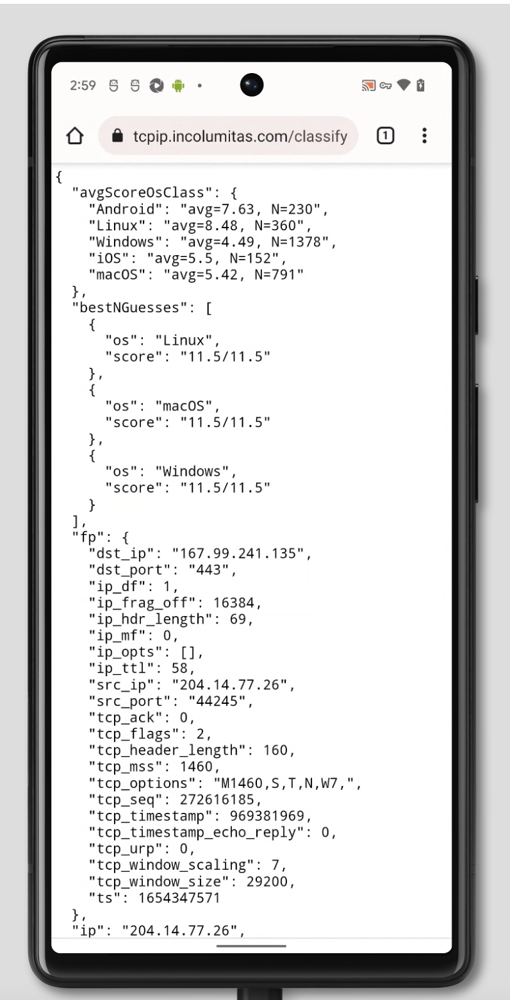

# Passive TCP/IP Fingerprinting 🚀

[Live Demo](https://tcpip.incolumitas.com/classify?by_ip=1)

Zardaxt.py is a passive TCP/IP fingerprinting tool. Run Zardaxt.py on your server to find out what operating systems your clients are *really* using. This tool considers the fields and options from the very first incoming SYN packet of the TCP 3-Way Handshake. Furthermore, in order to interpolate the [uptime via TCP timestamps](https://floatingoctothorpe.uk/2018/detecting-uptime-from-tcp-timestamps.html), the [TCP timestamp](https://www.rfc-editor.org/rfc/rfc1323#section-4) from a couple of consecutive TCP segments is taken.

**Why the rewrite?**

+ [p0f](https://github.com/p0f/p0f) is dead. It's database is too old. Also: C is a bit overkill and hard to quickly hack in.
+ [satori.py](https://github.com/xnih/satori) is extremely buggy and hard to use (albeit the ideas behind the *code* are awesome)
+ The actual statistics/traffic samples behind TCP/IP fingerprinting are more important than the tool itself. Therefore it makes sense to rewrite it.

**What can I do with this tool?**

This tool may be used to correlate an incoming TCP/IP connection with a operating system class. For example, It can be used to detect proxies, if the proxy operating system (mostly Linux) differs from the operating system taken from the User-Agent.

If the key `os_mismatch` is true, then the TCP/IP inferred OS is different from the User-Agent OS.

## Demo

+ [Live Demo & Blog Article](https://incolumitas.com/2021/03/13/tcp-ip-fingerprinting-for-vpn-and-proxy-detection/)
+ [API page](https://incolumitas.com/pages/TCP-IP-Fingerprint/)

## Real World Examples

I tested the TCP/IP fingerprinting tool on [browserstack](https://www.browserstack.com/). Browserstack.com uses real devices with real browsers. It's the perfect site to test this tool.

Please forgive me, browserstack sometimes reduces the resolution of the screen recording for the devices. It's not my fault here :)

### Safari on iPhone 13



### Chrome on Galaxy S22



### Edge on Windows 11



### Chrome 102 on Windows 7



### Chrome on Google Pixel 6



## Installation & Usage

**Important:** I tested this only on my Ubuntu 20.04 server. Installation currently does not work on my MacBook Pro for example.

First clone the repo:

```bash
# clone repo
git clone https://github.com/NikolaiT/zardaxt
# move into directory
cd zardaxt
```

Setup with `pipenv`. You can also use `pew`.

```bash
# install dependencies
apt install -y libpcap-dev

# create a virtual environment
pipenv shell --python python3
# install packages
pipenv install pypacker pcapy untangle requests
```

Now you need to create an environment file called `tcpip_fp.env` with the following variable:

```bash
# tcpip_fp.env
API_KEY='abcd1234' # set your API key here
```

You can do so with this command:

```bash
echo "API_KEY='abcd1234'" > tcpip_fp.env
```

Now we can run Zardaxt.py:

```bash
# load tcpip_fp.env file
set -a
source tcpip_fp.env
set +a

python tcp_fingerprint.py -i eth0 --classify
```

Or run in the background on your server

```bash
# load tcpip_fp.env file
set -a
source tcpip_fp.env
set +a

nohup python tcp_fingerprint.py -i eth0 --classify > fp.out 2> fp.err < /dev/null &
```

## Quick Example

Classifying my Android smartphone:

```bash
# activate python environment
pipenv shell

# load env variables
set -a
source tcpip_fp.env
set +a

# run zardaxt.py
python tcp_fingerprint.py -i eth0 --classify

# tool outputs

Loaded 2916 fingerprints from the database
listening on interface eth0

1654345217: 86.56.31.158:42706 -> 167.99.241.135:443 [SYN]
{'avgScoreOsClass': {'Android': 'avg=9.04, N=230',
                     'Linux': 'avg=8.11, N=360',
                     'Windows': 'avg=4.52, N=1378',
                     'iOS': 'avg=6.83, N=152',
                     'macOS': 'avg=6.78, N=791'},
 'bestNGuesses': [{'os': 'Android', 'score': '11.5/11.5'},
                  {'os': 'Android', 'score': '11.5/11.5'},
                  {'os': 'Android', 'score': '11.5/11.5'}],
 'fp': {'dst_ip': '167.99.241.135',
        'dst_port': '443',
        'ip_df': 1,
        'ip_frag_off': 16384,
        'ip_hdr_length': 69,
        'ip_mf': 0,
        'ip_opts': [],
        'ip_ttl': 53,
        'src_ip': '86.56.31.158',
        'src_port': '42706',
        'tcp_ack': 0,
        'tcp_flags': 2,
        'tcp_header_length': 160,
        'tcp_mss': 1460,
        'tcp_options': 'M1460,S,T,N,W8,',
        'tcp_seq': 4111906994,
        'tcp_timestamp': 377751994,
        'tcp_timestamp_echo_reply': 0,
        'tcp_urp': 0,
        'tcp_window_scaling': 8,
        'tcp_window_size': 65535,
        'ts': 1654345217},
 'perfectScore': 11.5}
```

## API Support

When you run `tcp_fingerprint.py`, the program automatically launches a simple web API that you can query. A http server is bound to `0.0.0.0:8249`. You can query it on `http://0.0.0.0:8249/classify`.

If you want to query the TCP/IP fingerprint only for the client IP address, use

```
curl http://0.0.0.0:8249/classify
```

If you want to query all fingerprints in the API database, you have to specify the API key:

```
curl http://0.0.0.0:8249/classify?key=abcd1234
```

If you want to query/lookup a specific IP address (Example: 103.14.251.215), you will have to specify the IP address and the API key:

```
curl http://0.0.0.0:8249/classify?key=abcd1234&ip=103.14.251.215
```

## Theory

Several fields such as TCP Options or TCP Window Size or IP Fragment Flag depend heavily on the OS type and version.

Detecting operating systems by analyizing the first incoming SYN packet is surely no exact science, but it's better than nothing.

Some code and inspiration has been taken from: <https://github.com/xnih/satori>

However, the codebase of github.com/xnih/satori was quite frankly
a huge mess (randomly failing code segments and capturing all Errors: Not good, no no no).

This project does not attempt to be exact, it should give some hints what might be the OS of the
incoming TCP/IP stream.

## What fields are used for TCP/IP fingerprinting?

Sources:

1. Mostly Wikipedia [TCP/IP fingerprinting article](https://en.wikipedia.org/wiki/TCP/IP_stack_fingerprinting)
2. A lot of inspiration from [Satori.py](https://github.com/xnih/satori)
3. Another TCP/IP fingerprinting [tool](https://github.com/agirishkumar/passive-os-detection/tree/master/OS-Fingerprinting)

### Entropy from the [IP header](https://en.wikipedia.org/wiki/IPv4)

+ `IP.ttl (8 bits)` - Initial time to live (TTL) value of the IP header. The TTL indicates how long a IP packet is allowed to circulate in the Internet. Each hop (such as a router) decrements the TTL field by one. The maximum TTL value is 255, the maximum value of a single octet (8 bits). A recommended initial value is 64, but some operating systems customize this value. Hence it's relevancy for TCP/IP fingerprinting.
+ `IP.flags (3 bits)` - Don't fragment (DF) and more fragments (MF) flags. In the flags field of the IPv4 header, there are three bits for control flags. The "don't fragment" (DF) bit plays a central role in Path Maximum Transmission Unit Discovery (PMTUD) because it determines whether or not a packet is allowed to be [fragmented](https://www.cisco.com/c/en/us/support/docs/ip/generic-routing-encapsulation-gre/25885-pmtud-ipfrag.html). Some OS set the DF flag in the IP header, others don't.

### Entropy from the [TCP header](https://en.wikipedia.org/wiki/Transmission_Control_Protocol)

+ `TCP.data_offset (4 bits)` - This is the size of the TCP header in 32-bit words with a minimum size of 5 words and a maximum size of 15 words. Therefore, the maximum TCP header size size is 60 bytes (with 40 bytes of options data). The TCP header size thus depends on how much options are present at the end of the header.
+ `TCP.window_size (16 bits)` - Initial window size. The idea is that different operating systems use a different initial window size in the initial TCP SYN packet.
+ `TCP.flags (9 bits)` - This header field contains 9 one-bit flags for TCP protocol controlling purposes. The initial SYN packet has mostly a flags value of 2 (which means that only the SYN flag is set). However, I have also observed flags values of 194 (2^1 + 2^6 + 2^7), which means that the SYN, ECE and CWR flags are set to one. If the SYN flag is set, ECE means that the client is [ECN](https://en.wikipedia.org/wiki/Explicit_Congestion_Notification) capable. Congestion window reduced (CWR) means that the sending host received a TCP segment with the ECE flag set and had responded in congestion control mechanism.
+ `TCP.acknowledgment_number (32 bits)` - If the ACK flag is set then the value of this field is the next sequence number that the sender of the ACK is expecting. *Should* be zero if the SYN flag is set on the very first packet.
+ `TCP.sequence_number (32 bits)` - If the SYN flag is set (1), then this is the initial sequence number. It is conjectured that different operating systems use different initial sequence numbers, but the initial sequence number is most likely randomly chosen. Therefore this field is most likely of no particular help regarding fingerprinting.
+ `TCP.urgent_pointer (16 bits)` - If the URG flag is set, then this 16-bit field is an offset from the sequence number indicating the last urgent data byte. It *should* be zero in initial SYN packets.
+ `TCP.options (Variable 0-320 bits)` - All TCP Options. The length of this field is determined by the data offset field. Contains a lot of information, but most importantly: The Maximum Segment Size (MSS), the Window scale value. Because the TCP options data is variable in size, it is the most important source of entropy to distinguish operating systems. The order of the TCP options is also taken into account.

### TCP Timestamp Mechanism

Source: <https://www.networkdatapedia.com/post/2018/10/08/how-tcp-works-the-timestamp-option>

What is a TCP Timestamp?

The timestamps option in TCP enables the endpoints to keep a current measurement of the roundtrip time (RTT) of the network between them. This value helps each TCP stack to set and adjust its retransmission timer. There are other benefits, but RTT measurement is the major one.

How it works.

Each end of the connection derives a 4-byte increasing value. This value is unique to each side and has no real numerical significance. The opposite end does not care what the value is, it will simply echo it back to the original sender. The original sender can then measure the timing between the packet(s) that were sent and received with this unique value.

The value used by each end will be increased as the connection goes along. Many TCP implementations will add the measured network RTT value (in milliseconds) to the 4-byte timestamp and use this new number for the next segment to be sent.

Put differently:

If both hosts support the TCP Timestamp mechanism, the initiating host will send a TCP timestamp value and the receiving host will echo this value, while at the same time sending it's own timestamp value. This allows both hosts to infer the RTT of the connection.

After the timestamp value was echoed to the host, it will add the RTT to the first value as next value of the TCP timestamp mechanism.

What is interesting from a fingerprinting perspective is not the actual RTT (maybe only to infer the type of network, or whether the RTT is stable), but more the following things:

1. How does the client choose to increase the timestamp value? Does the client increase the timestamp by the measure RTT? `timestamp_increase_type`
2. What is the frequency of the timestamp value? Is it 100hz, 250hz, or 1000hz? `timestamp_frequency`

Theory: <https://www.rfc-editor.org/rfc/rfc1323>
