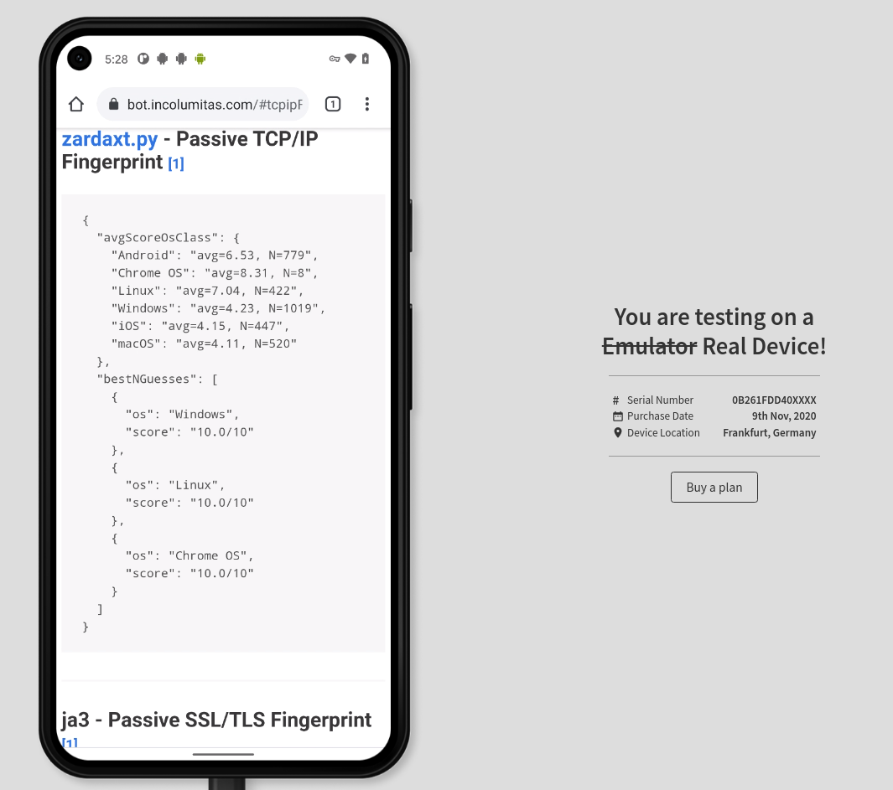
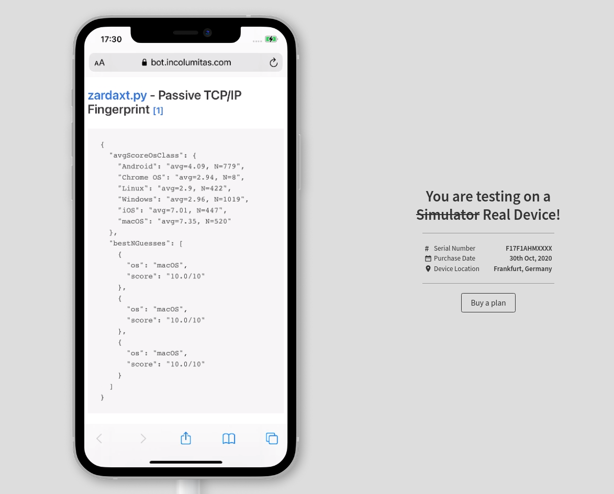
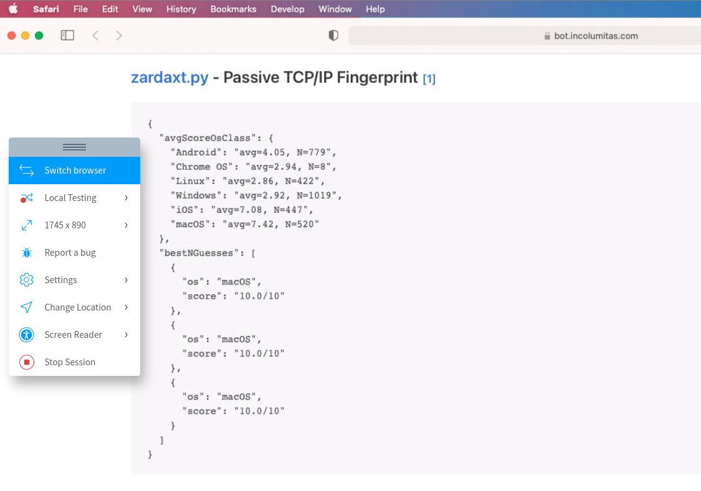
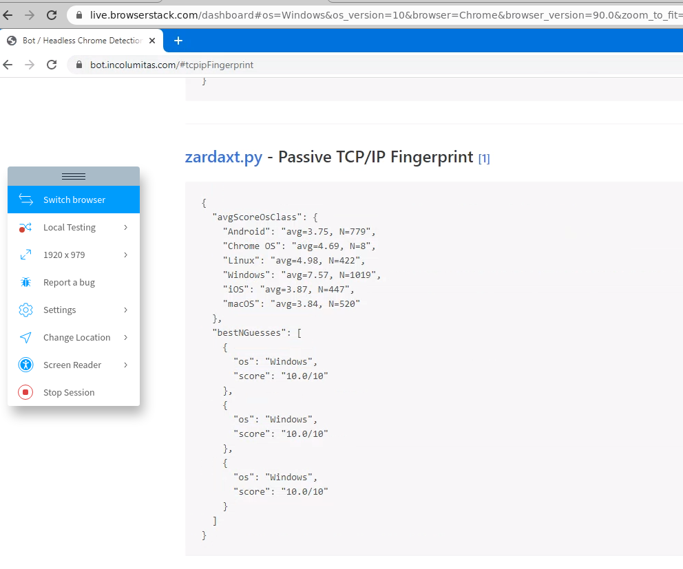

## Passive TCP/IP Fingerprinting

This is a passive TCP/IP fingerprinting tool. Run this on your server and find out what operating systems your clients are *really* using. This tool considers only the fields and options from the very first incoming SYN packet of the 
TCP 3-Way Handshake. Nothing else is considered.

Why?

+ [p0f](https://github.com/p0f/p0f) is dead. It's database is too old. Also: C is a bit overkill and hard to quickly hack in.
+ [satori.py](https://github.com/xnih/satori) is extremely buggy and hard to use (albeit the ideas behind the *code* are awesome)
+ The actual statistics behind TCP/IP fingerprinting are more important than the tool itself. Therefore it makes sense to rewrite it.

### Demo

[Live Demo & Blog Article](https://incolumitas.com/2021/03/13/tcp-ip-fingerprinting-for-vpn-and-proxy-detection/)


### Real World Examples

I tested the TCP/IP fingerprinting tool on [browserstack](https://www.browserstack.com/). Browserstack.com uses real devices with real browsers. It's the perfect site to test this tool. Here are the results:

#### Galaxy S21 Android with Chrome

`zardax.py` gives a high rating for all the Linux operating systems when the device is Android. Good enough.


#### Google Pixel 5 Android with Chrome

Same as above. The tool is able to say that it's a Linux OS, but not with certainity that it's Android.



#### iPhone 12 iOS with Safari

`zardax.py` gives a high rating for iOS and macOS, but can't say with certainity that it's iOS.



#### MacOs Big Sur with Safari

Same here. MacOS scores a bit higher, but `zardax.py` gives a high rating for both iOS and macOS, but can't say with certainity that it's macOS.



#### Windows 10 with Chrome

`zardax.py` 🚀🚀🚀🚀🚀🚀



### Example

Classifying my Android smartphone:

```bash
python tcp_fingerprint.py -i eth0 --classify

Loaded 3203 fingerprints from the database
listening on interface eth0

1618054161: 84.120.157.113:1812 -> 167.99.241.135:80 [SYN]
{'avgScoreOsClass': {'Android': 'avg=6.27, N=779',
                     'Chrome OS': 'avg=5.0, N=8',
                     'Linux': 'avg=4.99, N=422',
                     'Windows': 'avg=2.64, N=1019',
                     'iOS': 'avg=3.66, N=447',
                     'macOS': 'avg=3.64, N=520'},
 'bestNGuesses': [{'os': 'Android', 'score': '9.0/10'},
                  {'os': 'Android', 'score': '9.0/10'},
                  {'os': 'Android', 'score': '9.0/10'}]}
```

A iPhone (User-Agent: `iPhone; CPU iPhone OS 14_4_1 like Mac OS X`) visting my server. Based on the SYN fingerprint alone, it's not possible to discern whether it's an macOS device or iOS device. But the guess is accurate enough.

```bash
python tcp_fingerprint.py -i eth0 --classify

Loaded 3203 fingerprints from the database
listening on interface eth0

---------------------------------
1616184541: 85.19.65.217:49988 -> 167.99.241.135:443 [SYN]
{'avgScoreOsClass': {'Android': 'avg=4.18, N=36',
                     'Linux': 'avg=3.31, N=99',
                     'Windows': 'avg=3.36, N=365',
                     'iOS': 'avg=6.95, N=20',
                     'macOS': 'avg=7.26, N=189'},
 'bestNGuesses': [{'os': 'macOS', 'score': '10.0/10'},
                  {'os': 'macOS', 'score': '10.0/10'},
                  {'os': 'macOS', 'score': '10.0/10'}]}
---------------------------------
1616184541: 167.99.241.135:443 -> 85.19.65.217:49988 [SYN+ACK]
---------------------------------
```

And a Windows 10 (`Windows NT 10.0; Win64; x64`) device visiting my server:

```json
{
  "bestNGuesses": [
    {
      "score": "10.0/10",
      "os": "Windows"
    },
    {
      "score": "10.0/10",
      "os": "Windows"
    },
    {
      "score": "10.0/10",
      "os": "Windows"
    }
  ],
  "avgScoreOsClass": {
    "Windows": "avg=6.54, N=1019",
    "Android": "avg=3.12, N=779",
    "iOS": "avg=3.01, N=447",
    "macOS": "avg=2.99, N=520",
    "Linux": "avg=4.3, N=422",
    "Chrome OS": "avg=3.75, N=8"
  }
}
```

### Installation & Usage

First clone the repo:

```bash
git clone https://github.com/NikolaiT/zardaxt

cd zardaxt
```

Setup with `pipenv`.

```
pipenv shell

pipenv install
```

And run it

```bash
python tcp_fingerprint.py -i eth0 --classify
```

Or run in the background on your server

```bash
py=/root/.local/share/virtualenvs/satori-v7E0JF0G/bin/python
nohup $py tcp_fingerprint.py -i eth0 --classify > fp.out 2> fp.err < /dev/null &
```

## Api Support

When you run `tcp_fingerprint.py`, the program automatically launches a simple web API that you can query. A http server is bound to `0.0.0.0:8249`. You can query it on `http://0.0.0.0:8249/classify`.

It will return the last 500 classification results, IP addresses as keys. So your web application can comfortably query the most recent TCP/IP classification results like that

```
curl http://0.0.0.0:8249/classify
```

If you want to query the TCP/IP fingerprint only for the client IP address, use 

```
curl http://0.0.0.0:8249/classify?by_ip=1
```

## Theory

Several fields such as TCP Options or TCP Window Size or IP Fragment Flag depend heavily on the OS type and version.

Detecting operating systems by analyizing the first incoming SYN packet is surely no exact science, but it's better than nothing.

Some code and inspiration has been taken from: https://github.com/xnih/satori

However, the codebase of github.com/xnih/satori was quite frankly 
a huge mess (randomly failing code segments and capturing all Errors: Not good, no no no).

This project does not attempt to be exact, it should give some hints what might be the OS of the 
incoming TCP/IP stream.

### What fields are used for TCP/IP fingerprinting?

Sources:

1. Mostly Wikipedia [TCP/IP fingerprinting article](https://en.wikipedia.org/wiki/TCP/IP_stack_fingerprinting)
2. A lot of inspiration from [Satori.py](https://github.com/xnih/satori)
3. Another TCP/IP fingerprinting [tool](https://github.com/agirishkumar/passive-os-detection/tree/master/OS-Fingerprinting)

#### Entropy from the [IP header](https://en.wikipedia.org/wiki/IPv4)

+ `IP.ttl (8 bits)` - Initial time to live (TTL) value of the IP header. The TTL indicates how long a IP packet is allowed to circulate in the Internet. Each hop (such as a router) decrements the TTL field by one. The maximum TTL value is 255, the maximum value of a single octet (8 bits). A recommended initial value is 64, but some operating systems customize this value. Hence it's relevancy for TCP/IP fingerprinting.
+ `IP.flags (3 bits)` - Don't fragment (DF) and more fragments (MF) flags. In the flags field of the IPv4 header, there are three bits for control flags. The "don't fragment" (DF) bit plays a central role in Path Maximum Transmission Unit Discovery (PMTUD) because it determines whether or not a packet is allowed to be [fragmented](https://www.cisco.com/c/en/us/support/docs/ip/generic-routing-encapsulation-gre/25885-pmtud-ipfrag.html). Some OS set the DF flag in the IP header, others don't.

#### Entropy from the [TCP header](https://en.wikipedia.org/wiki/Transmission_Control_Protocol)

+ `TCP.data_offset (4 bits)` - This is the size of the TCP header in 32-bit words with a minimum size of 5 words and a maximum size of 15 words. Therefore, the maximum TCP header size size is 60 bytes (with 40 bytes of options data). The TCP header size thus depends on how much options are present at the end of the header. 
+ `TCP.window_size (16 bits)` - Initial window size. The idea is that different operating systems use a different initial window size in the initial TCP SYN packet.
+ `TCP.flags (9 bits)` - This header field contains 9 one-bit flags for TCP protocol controlling purposes. The initial SYN packet has mostly a flags value of 2 (which means that only the SYN flag is set). However, I have also observed flags values of 194 (2^1 + 2^6 + 2^7), which means that the SYN, ECE and CWR flags are set to one. If the SYN flag is set, ECE means that the client is [ECN](https://en.wikipedia.org/wiki/Explicit_Congestion_Notification) capable. Congestion window reduced (CWR) means that the sending host received a TCP segment with the ECE flag set and had responded in congestion control mechanism.
+ `TCP.acknowledgment_number (32 bits)` - If the ACK flag is set then the value of this field is the next sequence number that the sender of the ACK is expecting. *Should* be zero if the SYN flag is set on the very first packet.
+ `TCP.sequence_number (32 bits)` - If the SYN flag is set (1), then this is the initial sequence number. It is conjectured that different operating systems use different initial sequence numbers, but the initial sequence number is most likely randomly chosen. Therefore this field is most likely of no particular help regarding fingerprinting.
+ `TCP.urgent_pointer (16 bits)` - If the URG flag is set, then this 16-bit field is an offset from the sequence number indicating the last urgent data byte. It *should* be zero in initial SYN packets.
+ `TCP.options (Variable 0-320 bits)` - All TCP Options. The length of this field is determined by the data offset field. Contains a lot of information, but most importantly: The Maximum Segment Size (MSS), the Window scale value. Because the TCP options data is variable in size, it is the most important source of entropy to distinguish operating systems. The order of the TCP options is also taken into account.